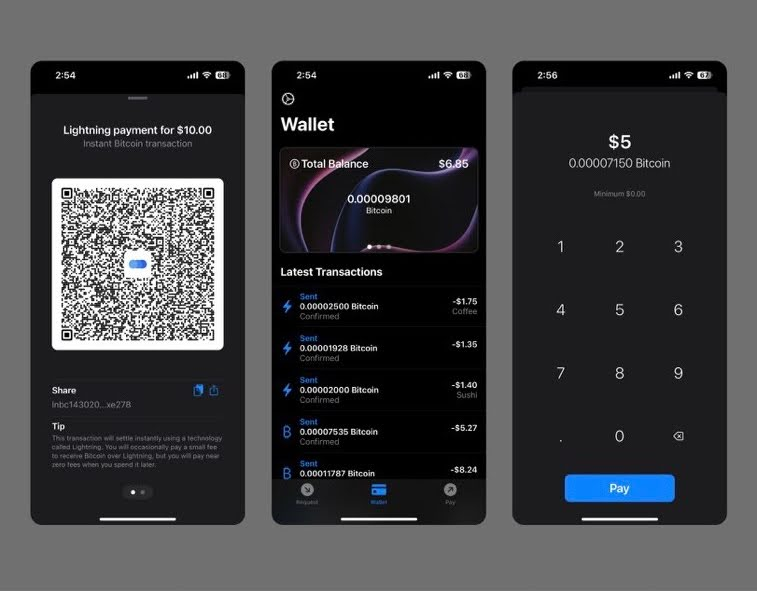

## App Summary

There are a number of available Bitcoin wallets on the App Store, all ranging in the robustness of features and design goals. Apps like [Strike](https://strike.me/) and Cash App bring a polished and native experience to mobile payments and Bitcoin, but they custody funds on behalf of their users. There are a number of apps that push self-custody forward like [BlueWallet](https://bluewallet.io/), [Pheonix](https://phoenix.acinq.co/) and [Breez](https://breez.technology/), however their engineering teams are focused on Lightning Node implementations, tools, and specifications. Typically small and technical teams like these reach for a cross-platform solution like Flutter or React Native to bring their app to market, but these tools are suboptimal when catering to Android or iOS specifically. There are Android-native self-custody wallets on the Google Play Store, yet the solutions for iOS have not hit the market or gained a significant portion of market share. This app, which is unnamed at the moment, aims to bridge the gap between well-funded, highly developed custodial wallets and the cross-platform self-custodial implementations. 

## Design First

SwiftUI is Apple's library of user interface components that are behind the latest versions of iOS apps. These components are aesthetically minimal, informative, and responsive. Opacity, animation, and proper spacing are all embedded in Apple's design suite. When dealing with money, users deserve to feel confident in the app they are using. A well-refined, familiar, and simple user interface goes a long way in developing the trust of end users. With SwiftUI as the backbone of this wallet, the user should feel a striking similarity between using this app and Apple's Wallet app. 

## Robust and Auditable Functionality

The internals that directly interact with the Bitcoin network are handled by the [Bitcoin Dev Kit](https://bitcoindevkit.org/) library. These developers are focused on releasing comprehensive tools that make wallet development as easy as possible. The BDK developers are dedicated to improving the library around the clock. Similarly, interactions with the Lightning Network are handled by the [Breez SDK](https://breez.technology/sdk/). The engineers at Breez have put together a truly incredible architecture that allows developers to integrate Lightning Payments in a miniscule amount of code. Each user of this app interacts with a cloud-based Lightning Node that allows for self custody without the typical funding and resources it would take to run a node. Both of these projects come together into this app, and the end result is a wallet that truly stands on the shoulders of giants. I am thankful for their continued development and contribution to the Bitcoin ecosystem. 
